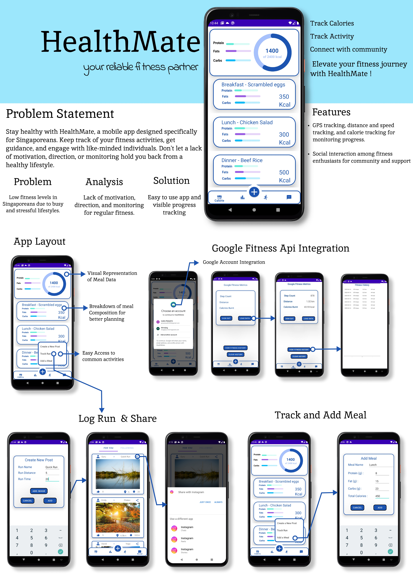

# HealthMate | **Your Reliable Fitness Partner**
**Course:** 50.001 - Introduction to Information Systems & Programming | SUTD

**Technologies:** Android Studio, Java/Kotlin, Google Fitness API, Google Maps API, SQLite

## Overview
HealthMate is a comprehensive mobile fitness application designed specifically for Singaporeans to combat low fitness levels caused by busy and stressful lifestyles. The app provides an integrated solution for calorie tracking, exercise monitoring, and social engagement, helping users maintain motivation and direction in their fitness journey through community support and comprehensive progress tracking.

## Features
- **Calorie Tracking System**: Interactive circular progress bar with comprehensive meal logging, displaying protein, fats, and carbs consumption with visual progress indicators
- **Google Fitness Integration**: Real-time data retrieval displaying step count, distance, and calories burned with SQL-based data management and account switching capabilities  
- **GPS-Enabled Exercise Tracking**: Google Maps integration for run tracking with automatic data synchronization to Google Fitness platform
- **Social Community Platform**: "For You" and "Following" feeds with Instagram integration, image sharing capabilities, and automatic activity name copying for convenience
- **Intelligent Goal Management**: Personalized calorie and workout goal suggestions based on user demographics with dynamic progress bar updates

## Skills Demonstrated

- **API Integration**: Seamlessly integrated Google Fitness API and Google Maps API for real-time data synchronization and GPS tracking functionality
- **Database Management**: Implemented SQLite database with CRUD operations for user data persistence and fitness history management  
- **Mobile UI/UX Design**: Developed intuitive Android interface with circular progress indicators, floating action buttons, and responsive navigation systems
- **Social Media Integration**: Built Instagram sharing functionality with clipboard automation and gallery/camera image selection features

## Installation and Usage

1. **Clone the repository:** `git clone https://github.com/Collaboration95/HealthMate`
2. **Prerequisites:** 
   - Android Studio 3.0 or later
   - Android SDK with API level 26 or higher
   - JDK 8
   - Physical Android device or emulator for testing
3. **Setup:** 
   - Open project in Android Studio
   - Sync with Gradle files: `File -> Sync Project with Gradle Files`
   - Build project: `Build -> Make Project`
4. **Run the project:** Deploy to Android device or emulator

### Usage Instructions
- **Account Setup**: Sign in with Google account for fitness data synchronization
- **Calorie Tracking**: Navigate to "Calorie" tab → Tap "+" → Input meal details → Save entry  
- **Exercise Tracking**: Select "Track a run" → Choose map location → Launch Google Maps for guided route tracking
- **Social Features**: Explore "For You" section → Follow users → Create posts with activity details and images
- **Goal Setting**: Update profile information → Click "Update Data" or "Suggest Goals" for personalized recommendations

## Technical Architecture

### Core Components
- **Frontend**: Native Android application with Material Design principles
- **Backend Integration**: Google Fitness API for health data, Google Maps API for location services
- **Data Storage**: Local SQLite database with cloud synchronization capabilities
- **Social Features**: Instagram API integration with image processing and sharing functionality

### Key Algorithms
- **Calorie Calculation**: BMR-based metabolic rate calculations with activity level adjustments
- **Route Optimization**: Google Maps integration for efficient running route suggestions  
- **Data Normalization**: Fitness metrics standardization across different data sources

## Lessons Learned
Developing HealthMate provided valuable insights into mobile app development challenges, particularly in API integration and data synchronization. Key learning areas included managing asynchronous API calls for real-time data updates, implementing efficient local data caching strategies, and creating intuitive user interfaces that encourage consistent engagement. The project highlighted the importance of user-centered design in fitness applications and the technical complexities of integrating multiple third-party services while maintaining app performance and user privacy.

## Acknowledgments
- **Google Maps API** - Location services and route tracking functionality
- **Google Fitness API** - Health and fitness data integration
